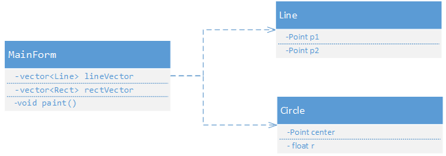
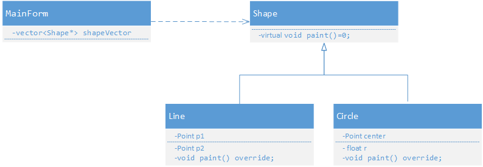

# 设计原则
设计的根本是使用**面向对象编程**应对各种**变化**，抵御变化，使得代码复用性更高。

### 面向对象设计原则
1. 依赖倒置原则 ***DIP*** 
    + 准则
        + 高层模块(稳定)不应该依赖于底层模板（变化），二者都应该依赖于抽象（稳定）
        + 抽象（稳定）不应该依赖于实现细节（变化），实现细节应该依赖于抽象（稳定）。 
    + 理解
        抽象定义为接口，实现细节类继承这个接口类，高层模块`has-a`这个抽象类对象指针，通过多态调用实现细节类的功能。
    + 举例    
        **在C++中没有`interface`关键字，一般是由虚基类实现**。
        + 原本方法  
        需要一个画图的类，目前只画“直线和矩形”，里面直接定义了两个成员变量。  
          
        类`mainForm`是直接依赖于两个具体类的，当需要增加画新的图像：圆形时候，不仅需要增加新的图形类`Circle`，对于`mainForm`而言，也是需要修改多处，增加成员变量`vector<Circle> circleVector`，函数`paint`也是修改修改。修改很大，代码复用性不高。  
        + 解决办法  
        将图型类抽象为基类`Shape`，定义为一系列接口，让子类实现。在`mainForm`直接包含`Shape`利用多态调用子类的实例。  
           
        如此，再需要增加新的类型，只需要继承`Shape`类，而`mainForm`基本不需要修改。  
        + 复盘  
         在本案例中，具体实现画图的类`Line`、`Rect` 、`Circle`等属于**变化**的，而`MainForm`属于**不变的**，不能直接让不变的`MainForm`依赖于实现细节。通过一个接口类实现解耦合。    

2. 开放封闭原则 ***OCK***   
    + 准则
        + 对扩展开放，对更改封闭
        + 类模块应该是可拓展的，但是不可修改
    + 理解
        比如上面的例子，如果要添加新的图形，`MainFrom`也需要修改，修改之后，不仅扩展了新的图形，本身还没有修改。
3. 单一职责原则 ***SRP*** 
    + 一个类应该仅仅有一个引起它变化的原因
    + 变化的方向隐含着类的责任

4. Liskov 替换原则 ***LSP*** 
    + 子类必须能够替换他们的基类(IS-A)
    + 继承表达类型抽象
5. 接口隔壁原则 ***ISP*** 
    + 不应该强迫用户依赖他们不用的方法
    + 接口应该小而完备
6. 优先使用对象组合，而不是类继承  
    + 类继承通常为“白箱复用”，对象组合通常为“黑箱复用”。
    + 继承在某种程度上破坏了封装性，子类父类耦合度高。
    + 而对象组合则只要求被组合的对象具有良好定义的接口，耦合度低
7. 封装变化点  
    + 使用封装来创建对象之间的分界层，让设计者可以在分界层的一侧进行修改，而不会对另一侧产生不良的影响，从而实现层次间的松耦合。
8. 针对接口编程，而不是针对实现编程
    + 不将变量类型声明为某个特定的具体类，而是声明为某个接口。
    + 客户程序无需获知对象的具体类型，只需要知道对象所具有的接口。
    + 减少系统中各部分的依赖关系，从而实现“高内聚、松耦合”的类型设计方案
### 正确使用设计模式姿势
 + [ ] 设计模式的要点是“寻求变化点”，然后在变化点应用设计模式，从而更好的应对需求的变化。
 + [ ] 设计模式应用不应该先入为主。没有一步到位的设计模式，提倡的是 ***`Refactoring to Pattern`*** 。 
    + 重构建议
        + 静态 --> 动态
        + 早绑定 --> 晚绑定
        + 编译时依赖 --> 运行时依赖
        + 紧耦合 --> 松耦合
        + 继承 --> 组合  
    上面三个，依赖于**虚函数**，下面两个实现**面向接口编程**，也需要虚函数的配合。