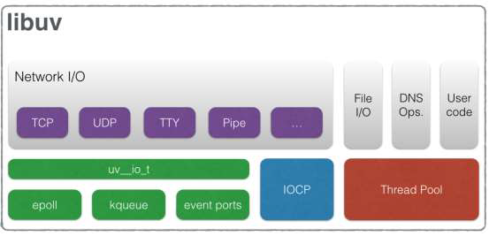

# Libuv
整个libuv充满了面向对象的设计思想、以及在容器的使用上的侵入式设计。



从上图中我们看到
+ Libuv 使用各平台提供的事件驱动模块实现异步（epoll, kqueue, IOCP, event
ports）。他用来支持上层非文件io 的模块。
+ Libuv 实现一个线程池用来支持上层文件io、dns 以及用户层耗cpu 的任务。

**框架设计**  

`libuv` 在整体的逻辑上和 `Muduo`还是有诸多相似之处。
+ `libuv`的 `uv__io_t`就是类似于 `Channel`。

    每次需要在`eventlopp`注册一个用户感兴趣的事件。在`Muduo`在通过`Channel`。在`Libuv`中使用基于`uv__io_t`的数据结构配合`uv_io_start`将 `io`及其感兴趣的事件注册到所属的`loop`的`epoll`中。   
    
    `libuv`中所有的`fd`都被包装成了`uv__io_t`，称为`xxx_watcher`，用来观察监视该文件描述符上的可读可写事件的产生。
    ```cpp
        struct uv__io_s {
          uv__io_cb cb;             // 任务回调函数
          void* pending_queue[2];   // 负责的是即将关注的任务队列
          void* watcher_queue[2];   // 已经关注的任务队列
          unsigned int pevents;     // 保存本次感兴趣的事件，在插入io 观察者队列时设置
          unsigned int events;      // 保存当前感兴趣的事件
          int fd;                   // 这个io观察的文件描述符
        };
    ```
    `libuv`中的`uv__io_t`常用几个函数
    + `uv_io_init`：初始化`uv__io_t`
    + `uv_io_start`：将 `fd`注册到`loop`的`epoll`中，并且设置感兴趣的事件
    + `uv_io_close`：也是会将`fd`从所属的`loop`的`epoll`中取消关注所有的事件，并且删除对应的`fd`。
    + `uv_io_stop`：只是取消关注事件，但是没有从`epoll`中删除相应的`fd`.
+ 唤醒`loop`都是用的 `eventfd`  
    1. Libuv  
       `libuv`在`loop`所属的主线程和线程池之间之间的通信方式，本质是通过 `eventfd`。当一些在线程池中执行需要通知主线程时，就是调用`uv_async_send`。本质是向`eventfd`写入了一个字节的数据，唤醒可能正在等待的`epoll`，使得能够立即执行回调函数`uv_async_io`：从`eventfd`中读取出来数据，并且调用任务完成的回调函数。

   1. Muduo  
      也是通过`eventfd`也唤醒`EventLoop`，功能和上面类似。

   1. 为什么需要 `eventfd` ?    
      对于`epoll`，如果没有网络IO和其他事件触发，那么这些`Loop`线程最好直接挂起而不是空转。如果有其任务要处理，这些线程能立即处理这些任务而不是在`epoll`处阻塞指定时间才去执行任务。因此，提供一种特殊的唤醒策略，就是`eventfd`。  

      `epoll`还是设置阻塞时间，但是当有其非网络io等任务到来时，就使用`eventfd`来激活`epoll`，使其不再阻塞，`loop`线程就能立马执行。

      在`Libuv`上，`eventfd`在`loop_t`被封装为`async_io_watcher.fd`。`async_io_watcher`也是个`uv__io_t`类型。而且这个`ansync_io_watcher.fd`是个单例，即整个程序运行期间都只有一个，这点和`Muduo`一致。

    1. `uv_async_t`  
    在`libuv`中，同一个任务提交多次，是会被合并的，最终只会提交一次：在第一次提交时`uv_async_send(uv_async_t* handle)`会设置`handle->pending=1`，下次同一个`handle`再提交时就会被合并的。

+ `accept`  
    1. Muduo  
    `Muduo`中，单独设计了一个`Acceptor`，只是负责监听新的连接的到来，而而后续的连接自己不负责，交给了 `TcpConnection` 来处理。

    2. libuv  
       `Libuv`中的`tcp`实现是继承自`uv_stream_t、uv_handle_t`。在`libuv`中，对于`accpet`有个设置，是否能连续`accept`，如果设置否，就会在所属线程每次`accpet`后就`nanosleep(time)`。

       在`libuv`中，tcp调用了`listen`之后就会在这个`tcp`的`sockfd`注册到所属的`loop`的`epoll`中，等待新的连接到来。
        ```cpp
            /* Start listening for connections. */
            // 有连接到来时的回调
            tcp->io_watcher.cb = uv__server_io;
            // 注册可读事件，等待可写事件发生
            uv__io_start(tcp->loop, &tcp->io_watcher, POLLIN);
        ```
        因此，最后负责建立`clientfd`是在`uv__server_io`中完成。
        ```cpp
          accepted_fd = uv__accept(uv__stream_fd(stream)); // 获取客户端的 fd
        ```
        在没有为这个`accepted_fd`建立连接之前，是不会接受下一个客户端的。建立之后会再次开启关注可读事件。
+ 线程安全性

  `libuv`是一个非线程安全的库，跨线程发送数据数不允许的。`uv`是不能跨线程使用`loop`。这点和`muduo`不同，`muduo`使用了`EvenetLoop`线程池，能够保证跨线程的安全使用。

**数据结构设计**

+ 定时器   
`libuv`使用的是小顶堆，堆顶的元素永远最早超时。而`Muduo`使用的是`std::set`来对定时器进行排序。前面的元素会最早超时。`muduo`使用的`timerfd`来设计定时器的。

+ 队列
  `libuv`的`QUEUE`，其实就是个侵入式的双向循环链表。在`libgo`也有。