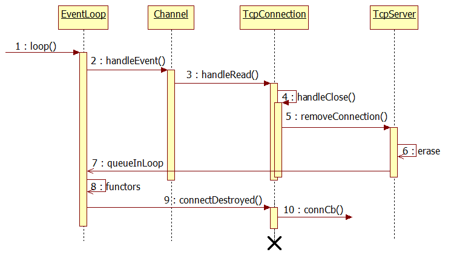

# 关闭时序

## ***`TcpServer`***
当客户端关闭连接时：
面对该连接的 `TcpConnection` 对象  `Conn` 就会触发 `channel_` 的可读事件，进行调用 `handleEvent()` 函数处理。
```cpp
    void Channel::handleEvent(Timestamp receiveTime) {
        std::shared_ptr<void> guard;
        if (tied_) {
            guard = tie_.lock();
            if (guard) {
                LOG_TRACE << "[6] usecount=" << guard.use_count();
                handleEventWithGuard(receiveTime);
                LOG_TRACE << "[12] usecount=" << guard.use_count();
            }
        }
        else {
            handleEventWithGuard(receiveTime);
        }
    }
```

整个客户端关闭，从这里开始，最后也会回到这里。```handleEventWithGuard``` 函数中调用了 `readCallback_` 回调函数。在 `Conn` 的创建时，传入的回调函数是：***`TcpConnection::handleRead`***：
```cpp
void TcpConnection::handleRead(Timestamp receiveTime) {
    loop_->assertInLoopThread();
    int savedErrno = 0;
    ssize_t n = inputBuffer_.readFd(channel_->fd(), &savedErrno);
    if (n > 0) {
        messageCallback_(shared_from_this(), &inputBuffer_, receiveTime);
    }
    else if (n == 0) {
        handleClose();
    }
    else {
        errno = savedErrno;
        LOG_SYSERR << "TcpConnection::handleRead";
        handleError();
    }
}
```
因为客户端请求关闭时，服务器端读取到的字节数为0，因此会调用 `handleClose()`：
```cpp
    void TcpConnection::handleClose() {
        loop_->assertInLoopThread();
        LOG_TRACE << "fd = " << channel_->fd() << " state = " << stateToString();
        assert(state_ == kConnected || state_ == kDisconnecting);
        setState(kDisconnected);    
        channel_->disableAll();   
        TcpConnectionPtr guardThis(shared_from_this()); // 引用计数加 1
        connectionCallback_(guardThis); 
        closeCallback_(guardThis); // 引用计数减少1
    }
```
在`handleClose()`函数中，
+ 先调用`connectionCallback_(guardThis);`
+ 再调用`closeCallback_(guardThis);`  
  
这两个回调函数都是由 `TcpServer` 在创建 `TcpConnection` 对象时传入，不同的是 `connectionCallback_(guardThis);` 这个函数是由外部传入的，即由`TcpServer`的使用者自定义后传入，而 `closeCallback_(guardThis);` 是由 `TcpServer` 内部函数:
```cpp
    void TcpServer::newConnection(int sockfd, const InetAddress& peerAddr) {
    ...
        TcpConnectionPtr conn(new TcpConnection(ioLoop, connName, sockfd,
                                                localAddr, peerAddr));
        connections_[connName] = conn;  
        conn->setConnectionCallback(connectionCallback_); 
        conn->setMessageCallback(messageCallback_);
        conn->setWriteCompleteCallback(writeCompleteCallback_);
        conn->setCloseCallback(std::bind(&TcpServer::removeConnection, this, _1)); 
        onn->connectEstablished(); 
        ...
    }
```
因此，在执行到 `closeCallback_(guardThis)` 时，即执行:
```cpp
    void TcpServer::removeConnection(const TcpConnectionPtr& conn) {
        loop_->assertInLoopThread();
        LOG_INFO << "TcpServer::removeConnectionInLoop [" << name_
                 << "] - connection " << conn->name();

        size_t n = connections_.erase(conn->name());
        (void)n;
        assert(n == 1);
        loop_->queueInLoop(
            boost::bind(&TcpConnection::connectDestroyed, conn));
    }
```
在这个函数中，最后会调用`TcpConnection::connectDestroyed()`，是因为要消除连接，那么就需要注销所有的通道，等这个函数也执行完，就会回到`handleEvent()`。对应的连接就会关闭了。

### **TcpConnection** 对象的生命周期  
`TcpConnection` 对象是由 `std::shared_ptr` 管理，因此当最后一个 `std::shared_ptr` 销毁时，那么对应的这个连接对象 `conn` 才会结束其生命周期。可以通过追踪 `std::shared_ptr` 的引用计数来追踪生命周期。
+ `std::shared_ptr` 引用计数增加的方式
    + 通过构造函数初始的引用计数总是1
    + 通过赋值/复制操作，增加引用计数
        ```cpp
            class Foo {/** ... */};
            
            void fun1(std::shared_ptr<Foo>) {/** ...*/ }
            void fun2(std::shared_ptr<Foo>& ) {/** ...*/ }

            int main() {
                Foo* foo = new Foo;
                std::shared_ptr<Foo> sp1(foo);
                std::shared_ptr<Foo> sp2(foo);
                std::shared_ptr<Foo> sp3 = sp1;
            }  
        ```
        比如上面的sp1，与sp2，尽管都是引用同一个对象指针，但是由于是通过构造函数完成的，因此他们的引用计数都是1，并不是共享计数，这就导致同一个对象会被析构两次。但sp3是通过赋值操作`=`完成，就和`sp1`共享引用，引用计数为2，`sp2`的引用计数为1。

        为了解决`sp1`与`sp2`应该使用 `shared_from_this`。

        同理，`fun1`会增加引用计数，而`fun2`不会增加。
+ `conn` 的生命周期  
 由于 `conn` 是通过 `std::share_ptr` 管理，那么它的生命周期也可通过引用计数来追踪。
    + 连接建立：
      ```cpp
        void TcpServer::newConnection(int sockfd, const InetAddress& peerAddr) {
        ...
            TcpConnectionPtr conn(new TcpConnection(ioLoop, connName, sockfd,
                                                    localAddr, peerAddr));
            connections_[connName] = conn;  
            conn->setConnectionCallback(connectionCallback_); 
            conn->setMessageCallback(messageCallback_);
            conn->setWriteCompleteCallback(writeCompleteCallback_);
            conn->setCloseCallback(std::bind(&TcpServer::removeConnection, this, _1)); 
            conn->connectEstablished(); 
            ...
        }
      ```
        + 建立 `conn` 时，引用计数为1
        + `connections_[connName] = conn;`引用计数加1
        + `conn->connectEstablished();` 执行函数时，内部会使得引用计数变为4，执行完恢复2.  
          ```cpp
            void TcpConnection::connectEstablished()
            {
              loop_->assertInLoopThread();
              assert(state_ == kConnecting);
              setState(kConnected);
              channel_->tie(shared_from_this()); 
              channel_->enableReading();
              // 创建的是一个临时std::shared_ptr对象
              // 这个函数，临时对象消毁，引用计数-1
              connectionCallback_(shared_from_this()); 
            }
          ```
        + `TcpServer::newConnection` 执行完毕，创建的局部变量 `conn` 会被销毁，只是剩下一个 **`connections_`** 中的指向 `conn` 的 `std::shared_ptr` 对象。  
        **因此，连接建立完成，引用计数为1。**
    + 连接关闭  
    要想关闭这个连接，那么其引用计数最后必须是0，那么怎么变成0的？
        + `Channel::handleEvent`中，`guard = tie_.lock();` 使得引用计数增加为2.
        + `TcpConnection::handleClose()`中，创建局部变量`guardThis`，使得引用计数增加为3。    
   
           `TcpServer::removeConnection(const TcpConnectionPtr& conn)`中，运行结束引用计数为3.  
            + [x] 传入的是引用并不增加计数
            + [x] `connections_.erase(conn->name())`会导致`connections_`中的那个`shared_ptr`销毁，减少1
            + [x] `loop_->queueInLoop(boost::bind(&TcpConnection::connectDestroyed, conn));`，`conn`复制传入，增加1。
        + `TcpConnection::handleClose()`运行结束，`guardThis`是局部变量，会销毁，因此引用计数减少1，变成2.
        + `Channel::handleEvent()`运行结束，`guard`也是局部变量，也会销毁，因此引用计数变成1。
        + 在`TcpConnection::connectDestroyed()`中：
            ```cpp
                void TcpConnection::connectDestroyed() {
                    loop_->assertInLoopThread();
                    if (state_ == kConnected) {
                        setState(kDisconnected);
                        channel_->disableAll();
                        connectionCallback_(shared_from_this()); // 这里
                    }
                    channel_->remove(); 
                }
            ```
            当 `connectionCallback_(shared_from_this());` 也执行完毕，连接对象的引用计数就会变成0。到此，`conn` 生命周期就会结束。
+ `Channel`的成员  
    ```cpp
        class Channel {
        private:
            ...
            std::weak_ptr<void> tie_;
            bool tied_;
            ...
        };
    ```
    + 为什么这里的 `tie_`数据类型是 **`std::weak_ptr`**  
    `std::weak_ptr` 是为生命周期设计的如果这里是 `std::shared_ptr`，那么这个接受的是 `std::shared_ptr<TcpConnection> tie_`，这就会导致`TcpConnection`对象无法释放：即循环引用，因为：
        + `TcpConnection` 内含一个 `std::uniqued_ptr<Channel> channel_` 
        + `Channel` 又内含一个 `std:::shared_ptr<TcpConnection> tie_`  


      `channel_` 要想释放 --> 首先要释放`channels_`内部的` tie_` 指向的 `TcpConnection` 对象 ---> 而 `TcpConnection`对象的释放，又需要内部成员变量 `channel_`的释放 --> 死锁，造成内存泄露

      如此最后都无法释放，那么就会产生内存泄漏。解决办法就是使得其中一个为`std::weak_ptr`。当需要使用所管理的对象时，再使用`lock()`函数，返回 `std::shared_ptr` 类型，并且使这个临时对象为局部变量，因此不会造就内存泄漏的问题。

      下面给出一个内存泄露的写法：
      ```cpp
        class Goo;

        class Foo { 
        public:
          Foo() { std::cout<<" foo_ctor\n";}
          ~Foo() { std::cout<<" foo_dtor\n";}
          void set(std::shared_ptr<Goo> gptr) { gptr_ = gptr; }
        private:
          std::shared_ptr<Goo> gptr_; ///  std::weak_ptr 就可以避免
        };

        class Goo : public std::enable_shared_from_this<Goo> { 
        public:
           Goo():fptr_(new Foo) { std::cout<<" goo_ctor\n"; }
          ~Goo() { std::cout<<" goo_dtor\n";}
          
          void set() { fptr_->set(shared_from_this()); }
        private:
          std::unique_ptr<Foo> fptr_; 
        };

        int main(int argc, char const *argv[]) {

          std::shared_ptr<Goo> gptr = std::make_shared<Goo>();
          gptr->set();

          return 0;
        }
      ```

      编译输出，会发现没有析构。
      ```
       foo_ctor
       goo_ctor
      ```
